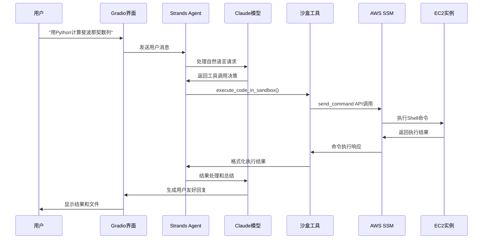

# Sandbox on EC2 Instance

基于EC2实例的安全代码执行沙箱工具，为 AI Agents 提供云端代码执行能力。

## 特性

- 🚀 **基于EC2实例**：利用现有EC2实例和API，支持 Graviton, GPU, 无需复杂的容器化
- 🏗️ **模块化架构**：核心环境、沙盒实例、工具函数分离，易于维护和扩展
- 🌍 **多运行时支持**：支持Python、Node.js、Bash等多种运行环境**
- ⚡ **资源限制**：内存、CPU时间、文件大小等资源限制
- 📁 **文件系统隔离**：为每个任务创建独立的工作目录，确保任务间完全隔离
- 🧹 **自动清理**：定时清理过期的任务目录
- 🛠️ **配置管理**：自动验证配置参数有效性，支持多环境和多种认证方式
- 🌐 **环境变量覆盖**：支持通过环境变量动态调整配置
- 🔒 **安全增强**：文件名安全检查、环境变量清理、路径遍历防护
- 🤖 **多种集成方式**：支持Strands Agent工具调用和MCP协议标准化接口
- 🔌 **MCP协议支持**：完整的Model Context Protocol服务器实现，标准化AI工具接入

**取决于沙盒环境(EC2实例)的运行时配置

## 核心组件

- **EC2SandboxEnv**: 沙盒环境实现，管理EC2实例连接和基础设施
- **SandboxInstance**: 具体的代码执行实例，负责任务执行和文件管理
- **ConfigManager**: 沙盒环境配置管理器，支持多环境和验证
- **SessionManager**: 会话和任务管理
- **Utils工具函数**: 日志配置、安全检查、AWS客户端创建、任务hash生成等
- **Strands Tools**: 基于Strands Agents实现的沙盒工具
- **MCP Server**: Model Context Protocol服务器，提供标准化AI工具接口

**项目结构**
```
ec2-sandbox-tool/
├── ec2_sandbox/           # EC2沙盒核心模块
│   ├── core.py            # 沙盒环境管理
│   ├── sandbox.py         # 沙盒实例管理
│   ├── strands_tools.py   # Strands Agents工具集成
│   └── utils.py           # 工具函数和日志配置
├── ec2_sandbox_mcp/       # MCP服务器模块
│   └── server.py          # FastMCP服务器实现
├── pyproject.toml          # uv项目配置和依赖管理
├── config_manager.py       # 配置管理器
├── config.json             # 主配置文件
├── config.json.template    # 配置模板
├── mcp_config.json         # MCP客户端配置文件示例
├── create_sandbox_xxx.sh   # 沙盒环境自动化准备脚本
├── README.md               # 项目说明文档
└── tests/                  # 测试脚本
```

## 安全特性

### 文件系统隔离
- 每个任务有独立的工作目录
- 基于任务hash的目录命名
- 自动清理过期目录
- 文件名安全检查，防止路径遍历攻击

### 资源限制
- CPU时间限制（ulimit -t）
- 虚拟内存限制（ulimit -v）
- 文件大小限制（ulimit -f）
- 文件描述符限制（ulimit -n）

### 环境变量安全
- 环境变量名格式验证
- 危险字符转义处理
- 防止注入攻击

### 自动清理机制
- 每小时自动执行清理任务
- 清理超过配置时间的旧任务目录
- 可手动控制清理定时器

### 配置验证
- 自动验证必需参数
- 检查数值范围和有效性
- 验证认证配置完整性

## 认证方式

配置管理器根据配置参数自动选择认证方式：

1. **AWS Profile**: 提供 `aws_profile` 参数
2. **访问密钥**: 提供 `access_key_id` 和 `secret_access_key`
3. **临时凭证**: 额外提供 `session_token`

## 创建沙盒环境

### 1. 自动化环境准备（推荐）

使用提供的脚本自动创建和配置EC2沙盒环境：

```bash
# 使用默认设置创建环境
./create_sandbox_ec2.sh

# 自定义实例类型
./create_sandbox_ec2.sh --type t3.small

# 查看所有选项
./create_sandbox_ec2.sh --help
```

脚本会自动完成：
- ✅ 检查必需工具（AWS CLI、jq）
- ✅ 验证AWS配置
- ✅ 创建IAM角色和实例配置文件
- ✅ 创建安全组（仅允许EIC访问SSH）
- ✅ 启动Ubuntu 24.04 LTS实例并安装运行时环境
- ✅ 配置SSM和EIC访问（无需密钥对）
- ✅ 生成/更新配置文件
- ✅ 测试连接

### 2. 手动创建EC2实例

如果选择手动创建，确保你的EC2实例满足以下要求：

- 使用Ubuntu 24.04 LTS或Amazon Linux 2023
- 安装了SSM Agent（Ubuntu 24.04默认已安装）
- 具有适当的IAM角色，允许SSM访问
- 预安装了需要的运行时环境（Python、Node.js等）
- 安全组配置允许必要的访问（推荐仅EIC访问SSH）

并基于配置模板创建你的配置文件：

```bash
# 复制配置模板
cp config.json.template config.json

# 编辑配置文件
vim config.json
```

### 3. 多环境配置示例

根据不同场景定义多个沙盒环境：
```json
{
  "sandbox-default": {
    "instance_id": "i-1234567890abcdef0",
    "region": "us-east-1",
    "aws_profile": "default",
    "base_sandbox_dir": "/opt/sandbox",
    "max_execution_time": 300,
    "max_memory_mb": 1024,
    "cleanup_after_hours": 24
  },
  "sandbox-prod": {
    "instance_id": "i-dev123456789",
    "region": "us-east-1",
    "aws_profile": "prod",
    "base_sandbox_dir": "/opt/sandbox",
    "max_execution_time": 900,
    "max_memory_mb": 512,
    "cleanup_after_hours": 1
  },
  "sandbox-gpu": {
    "instance_id": "i-ds123456789",
    "region": "us-east-1",
    "aws_profile": "data",
    "max_execution_time": 1800,
    "max_memory_mb": 8192,
    "cleanup_after_hours": 72
  }
}
```

### 4. 使用配置管理器验证配置

```bash
# 列出所有环境
uv run config_manager.py --list

# 验证特定环境
uv run config_manager.py --validate sandbox-default

# 查看配置详情
uv run config_manager.py --show sandbox-prod

# 检查认证方式
uv run config_manager.py --auth sandbox-prod
```

### 5. 配置参数详解

| 参数 | 类型 | 必需 | 默认值 | 范围 | 说明 |
|------|------|------|--------|------|------|
| `instance_id` | string | ✅ | - | - | EC2实例ID |
| `region` | string | ✅ | - | - | AWS区域 |
| `aws_profile` | string | * | - | - | AWS配置文件名 |
| `access_key_id` | string | * | - | - | AWS访问密钥ID |
| `secret_access_key` | string | * | - | - | AWS秘密访问密钥 |
| `session_token` | string | - | - | - | 临时凭证token |
| `base_sandbox_dir` | string | - | `/opt/sandbox` | - | 沙盒基础目录 |
| `max_execution_time` | int | - | `300` | 30-3600 | 最大执行时间(秒) |
| `max_memory_mb` | int | - | `1024` | 128-8192 | 最大内存(MB) |
| `cleanup_after_hours` | int | - | `24` | 1-168 | 清理时间(小时) |
| `allowed_runtimes` | array | - | 自动设置 | - | 允许的运行时 |

*认证参数：必须提供 `aws_profile` 或 `access_key_id`/`secret_access_key`

### 6. 环境变量覆盖

同时支持使用环境变量覆盖沙盒环境配置，支持的环境变量：

| 环境变量 | 配置参数 | 示例 |
|----------|----------|------|
| `EC2_INSTANCE_ID` | `instance_id` | `i-1234567890abcdef0` |
| `AWS_DEFAULT_REGION` | `region` | `us-east-1` |
| `AWS_PROFILE` | `aws_profile` | `default` |
| `AWS_ACCESS_KEY_ID` | `access_key_id` | `AKIA...` |
| `AWS_SECRET_ACCESS_KEY` | `secret_access_key` | `wJal...` |
| `AWS_SESSION_TOKEN` | `session_token` | `AQoD...` |
| `SANDBOX_BASE_DIR` | `base_sandbox_dir` | `/opt/sandbox` |
| `MAX_EXECUTION_TIME` | `max_execution_time` | `600` |
| `MAX_MEMORY_MB` | `max_memory_mb` | `2048` |
| `CLEANUP_AFTER_HOURS` | `cleanup_after_hours` | `12` |

#### 环境变量使用示例

```bash
# 临时覆盖配置
export EC2_INSTANCE_ID=i-override123
export MAX_EXECUTION_TIME=600
uv run python your_script.py

# 或在脚本中设置
EC2_INSTANCE_ID=i-override123 MAX_EXECUTION_TIME=600 uv run python your_script.py
```

## 使用EC2沙盒

### 1. 基础使用

```python
from config_manager import ConfigManager
from ec2_sandbox.core import EC2SandboxEnv

# 从配置文件加载配置
manager = ConfigManager('config.json')
config = manager.get_sandbox_config('sandbox-default')  # 或其他环境名

# 创建沙箱环境
sandbox_env = EC2SandboxEnv(config)
sandbox = sandbox_env.create_sandbox_instance("your_task_id")

# 执行Python代码
result = sandbox.execute_code(
    code="""
print("Hello from EC2 Sandbox!")
import sys
print(f"Python version: {sys.version}")
""",
    runtime="python"
)

print(f"执行成功: {result.success}")
print(f"输出: {result.stdout}")
```

### 2. 与Strands Agents集成

```python
from strands import Agent
from strands.models.bedrock import BedrockModel
from config_manager import ConfigManager
from strands_tools import create_strands_tools

# 从配置文件创建工具
manager = ConfigManager('config.json')
config = manager.get_sandbox_config('sandbox-default')
tools = create_strands_tools(config, 'sid-a1b2c3d4e5f')

# 创建BedrockModel（需要us-west-2区域）
bedrock_model = BedrockModel(
    model_id="us.anthropic.claude-3-7-sonnet-20250219-v1:0",
    region_name="us-west-2",
    temperature=0.1,
    max_tokens=4000
)

# 创建Agent
agent = Agent(
    model=bedrock_model,
    system_prompt="你是一个代码执行助手，可以在EC2沙箱中安全执行代码。",
    tools=tools
)

# 使用Agent
response = agent("请执行一个Python脚本计算斐波那契数列的前10项")
```
### 3. 高级用法

#### 带文件的代码执行

```python
# 准备输入文件
files = {
    "data.csv": "name,age\nAlice,25\nBob,30",
    "config.json": '{"format": "csv"}'
}

# 执行代码
result = sandbox.execute_code(
    code="""
import json
import csv

with open('config.json') as f:
    config = json.load(f)

with open('data.csv') as f:
    reader = csv.DictReader(f)
    data = list(reader)

print(f"Loaded {len(data)} records")
for record in data:
    print(record)
""",
    runtime="python",
    files=files,
    create_filesystem=True
)
```

#### 环境变量设置

```python
result = sandbox.execute_code(
    code="""
import os
print(f"API Key: {os.environ.get('API_KEY')}")
print(f"Debug Mode: {os.environ.get('DEBUG_MODE')}")
""",
    runtime="python",
    env_vars={
        "API_KEY": "your-api-key",
        "DEBUG_MODE": "true"
    }
)
```

#### 获取生成的文件

```python
# 执行代码后获取文件
files = sandbox.get_task_files(result.task_hash)
print(files)  # {"output.txt": "file content", ...}

# 获取特定文件
content = sandbox.get_task_files(result.task_hash, filename="result.json")
```

### 4. 演示程序

查看以下文件获取完整的使用示例：

- `demo_sandbox.py`     - 沙盒工具功能演示
- `demo_strands_agent.py`  - Strands Agents工具集成演示

在沙盒功能演示中，用户请求到代码执行的完整链路：



## Strands EC2沙箱工具

### execute_code_in_sandbox
在EC2沙箱中执行代码

**参数:**
- `code`: 要执行的代码
- `runtime`: 运行时环境 (python3, node, bash等)
- `task_id`: 任务ID，用于标识任务
- `files`: 需要创建的文件 {filename: content}
- `env_vars`: 环境变量 {key: value}
- `create_filesystem`: 是否创建独立的文件系统(默认 True)

**代码长度限制:**
- 最大支持70KB代码（基于AWS SSM实际测试）
- 超长代码会收到详细的优化建议

### get_task_files
获取任务目录中的文件内容

**参数:**
- `task_hash`: 任务hash值
- `filename`: 特定文件名（可选）

### cleanup_expired_tasks
清理过期的任务目录

**参数:**
- `hours`: 清理多少小时前的任务

### check_sandbox_status
检查沙盒环境(EC2实例)状态

## 测试

运行测试套件验证功能：

```bash
# 运行 Sandbox 功能测试
uv run python tests/test_sandbox_full.py

# 运行 StrandsAgent 集成测试
uv run python tests/test_sandbox_agent.py
```

**测试覆盖：**
- ✅ 基础工具功能测试
- ✅ Strands Agent集成测试（复杂数学问题）
- ✅ 代码长度限制测试
- ✅ 文件操作测试

## 故障排除

### 常见问题

1. **配置文件未找到**
   ```
   FileNotFoundError: Configuration file not found: config.json
   ```
   解决：复制 `config.json.template` 到 `config.json`

2. **配置验证失败**
   ```
   ValueError: Configuration validation failed
   ```
   解决：使用 `uv run python config_manager.py --validate environment` 检查配置

3. **SSM连接失败**
   - 确保EC2实例安装了SSM Agent
   - 检查实例的IAM角色是否有SSM权限
   - 确认实例状态为"running"

4. **权限错误**
   - 检查AWS凭证是否正确
   - 确认IAM用户/角色有EC2和SSM权限

5. **执行超时**
   - 检查代码是否有无限循环
   - 调整配置中的`max_execution_time`参数

6. **代码长度限制错误**
   ```
   代码过长 (81,920 字节 = 80.0KB)，超过安全限制
   ```
   解决：根据错误提示优化代码，移除不必要内容，或分解为多个步骤

### 日志调试

```python
import logging
logging.basicConfig(level=logging.DEBUG)
```

## 许可证

MIT License
